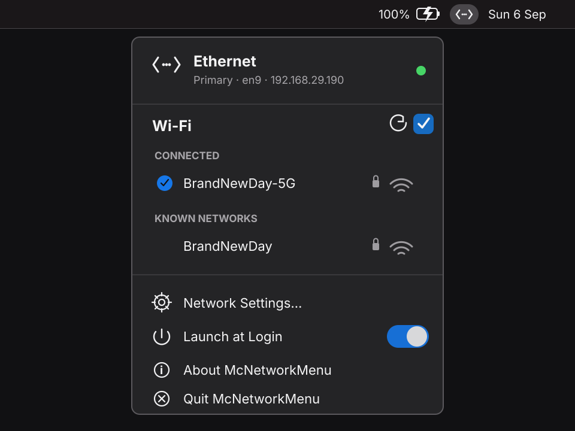

# McNetworkMenu

McNetworkMenu is a native SwiftUI menu-bar utility for macOS. Its icon follows the interface carrying the default route: Wi-Fi uses the native `wifi` symbol, Ethernet uses an original angle-bracket-and-nodes template glyph inspired by Network Settings, and offline uses `network.slash`. Route monitoring begins when the app model is created, so the menu-bar icon does not depend on opening the panel first.

The panel keeps the active interface first while leaving Wi-Fi controls immediately available. It can show nearby and remembered networks, join or disconnect Wi-Fi, toggle Wi-Fi power, open System Settings, manage Launch at Login, show About, and quit. Remembered networks and their credentials remain managed by macOS.

## Preview



_Ethernet is shown as the active default route while Wi-Fi remains available for quick switching._

## Requirements

- macOS 14 Sonoma or newer
- Swift 5.9 or newer from Apple Command Line Tools
- GNU-compatible `make` (the macOS-provided Make works)
- No Xcode project and no Xcode GUI

The checked-in Makefile currently defaults to the Command Line Tools macOS 15.4 SDK because the local Swift compiler and newer installed SDK have incompatible patch versions. Override `SDKROOT` when your toolchain uses another compatible SDK.

## Build and test

```sh
make build       # Debug bundle
make test        # Hardware-free unit tests using mock data
make release     # Release bundle
make check       # Tests followed by verified Release bundle
make run         # Build and launch the Debug app
make clean       # Remove generated .build output
```

Generated bundles are written to:

- `.build/apps/debug/McNetworkMenu.app`
- `.build/apps/release/McNetworkMenu.app`

The build uses ad-hoc signing by default. To use a certificate already installed in your keychain:

```sh
make release SIGNING_IDENTITY="Your Certificate Common Name"
```

This project is intended for self-publishing on GitHub rather than the Mac App Store. A self-signed or ad-hoc signature is not automatically trusted by other Macs; Gatekeeper behavior is therefore expected to differ from a notarized Developer ID release.

## Install and Launch at Login

Copy `McNetworkMenu.app` to `/Applications` before enabling Launch at Login. Running from a build folder and later moving the app can leave macOS pointing at the old registration location.

McNetworkMenu is an agent app (`LSUIElement`) and does not show a Dock icon. Use **Quit McNetworkMenu** in its panel to stop it.

## Privacy and platform behavior

McNetworkMenu requests Location access only when a named nearby-network scan is first needed. macOS gates visible Wi-Fi names behind this permission. For new secured networks, password text stays in the SwiftUI secure field, is passed directly to CoreWLAN for the attempted association, and is then cleared. For known secured networks, the app reads the existing macOS Keychain password only for that association. Neither path logs or persists credentials in McNetworkMenu.

The app primarily uses public Apple APIs: Network, CoreWLAN, CoreLocation, ServiceManagement, AppKit, and SwiftUI. To open Network Settings directly on macOS 14 or later, it also uses the undocumented `x-apple.systempreferences:com.apple.Network-Settings.extension` destination. This is a narrowly scoped compatibility dependency that may change in a future macOS release. The app does not reorder network services, change the default route, edit remembered-network profiles, or bypass administrator approval.

Automated validation currently uses mock path, Wi-Fi, permission, login-item, and application-action data. Real-hardware checks are intentionally deferred and listed in [docs/smoke-tests.md](docs/smoke-tests.md).

## License

Copyright (C) 2026 Prakhar Pal. McNetworkMenu is licensed under the GNU General Public License, version 3 or (at your option) any later version. See [COPYING](COPYING) for the full license text.
